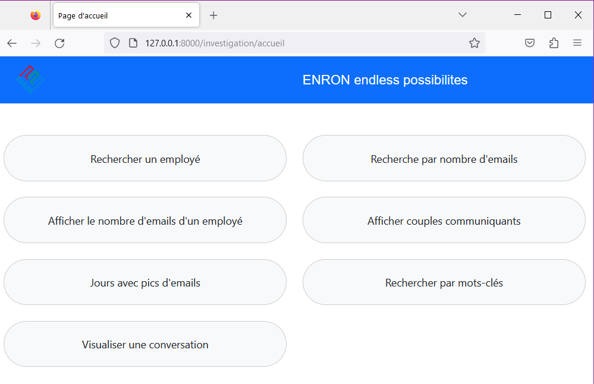
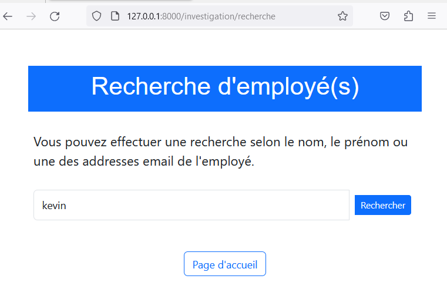
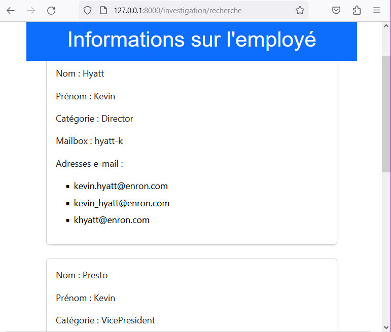

# Documentation de notre application web Enron
 Implémentation d'une application web permettant de passer des requêtes paramétrées et de visualiser les réponses, en utilisant Django+PostegreSQL


Réalisé par Jennifer NGOUNA et Thomas DELAUNAY 
M1 DS, Universtié d'Angers


### Contexte

L’affaire Enron (https://fr.wikipedia.org/wiki/Scandale_Enron) est connue comme l’un des plus
grands cas de manipulation financière aux États-Unis. Parmi les diverses enquêtes judiciaires
menées, la fouille des contenus des e-mails a constitué une piste essentielle pour comprendre la
dynamique entre les différents acteurs et leur rôle dans l’affaire. D'où l'intérêt de notre travail reposant principalement sur la fouille des contenus des e-mails.

L'objectif étant de développer une application destinée aux enquêteurs (non informaticiens ou tout autre utilsateur).  Elle leur propose un jeu de formulaires leur permettant d'explorer, de visualiser et d'analyser des données. Un formulaire correspond à une interrogation/visualisation, il fixe certains paramètres de la requête ainsi que d'éventuelles options  pour la visualisation.  Il a été necessaire de se mettre dans la peau d'un enquêteur afin d'imaginer quelles requêtes sont
pertinentes, et quelles visualisations sont judicieuses.


## Prérequis

Les données sont une arborescence de boîtes mails et un fichier XML. L’archive est
récupérable depuis https://math.univ-angers.fr/perso/jaclin/enron/.

L'utilisation de ce projet avec votre ordinateur  nécessite de disposer, sur sa machine:
- d'un connexion internet pour récupérer l'archive
- d'un terminal 
- d'un éditeur de code source telle que Visual Studio Code, Notepad++, Sublime ou tout autre éditeur disponible sous windows, linux,mac.
- d'un navigateur.

[](#description)Description du projet
-----------------------------
Ce projet se compose de six classes:
- Employee: gère les informations des employés issus du fichier XML uniquement.
- AddresseEmail : gère les addresses mail.
- ReceiversMail : gère les destinataires associés au différents emails.
- Email : gère les messages de type email ou mail.
- CoupleCommunication : gère les couple d'envoyées ayant communiqué entre eux.

[](#librairies_python) Librairies python utilisées
----------------------------------------

Grand est le nombre de libraires python qui nous ont été utiles tout au long de ce projet. Nous ne partagerons que les principales, à savoir:

- le framework `django` qui regorge d'outils d'aide au dévéloppement.
- le système de gestions de base de données `PostgreSQL`.
- `xml.etree.ElementTree ` qui traire les fichiers de types XML.
- `connection` du module `django.db`: responsable de la gestion des intéractions avec la base de données.
- `transaction` du module `django.db`: outil puissant pour gérer les transactions de base de données. Il simplifie le processus de garantir l'intégrité et la cohérence des données lors d'opérations complexes impliquant plusieurs requêtes SQL.

Nous vous recommandons la documentation officielle de django [lien](https://docs.djangoproject.com/en/5.0/)


## Guide d'utilisation (réalisé avec Visual Studio Code principalement) sur votre machine

> ⚠️ **_Si vous utilisez _git/github__**

### Récupérer le projet à partir de `github`

 Commençons par récupérer la copie du travail sur votre machine à partir de ce compte `github`.  Pour ce faire vous disposez de deux méthodes.
> 1. soit vous le télécharger depuis github en cliquant sur l'icône (+)
> 1. soit à partir  de `git bash` en suivant la procédure : 
>````python
>$ git clone git@github.com:Thomas-DELAUNAY/Bddr-2024.git
>````
> qui crée une copie du dossier

Ensuite on télécharge le fichier XML et le dossier maildir que vous devez décompresser à l'aide d'un logiciel ou depuis le terminal en faisant `tar -xvf nom_du_fichier.tar`

````python
tar -xvf enron_mail_20150507.tar.gz
````
Ce processus peut prendre du temps selon les performances de votre appareil. Après téléchargements, on peut lancer notre application.

### Lancement de l'application

Maintenant que tout est place, on se rend dans le dossier concerné ici ` C:\Users\utilisateur\Desktop\BDDR\projetBDDR`. On vérifie dans le fichier `settings.py`  qu'on entre nos identifiants pour se connecter à PostgreSQL

````python
DATABASES = {
    'default': {
        'ENGINE': 'django.db.backends.postgresql',
        'NAME': 'projet',
        'USER': 'postgres',
        'PASSWORD': 'XXXX',
        'HOST': 'localhost',
        'PORT': '5432',
    }
}
````

Appliquer les étapes suivantes pour créer la base de donnée `projet`, ensuite créer les tables:
````python
PS C:\Users\utilisateur\Desktop\BDDR\projetBDDR> cd projetBDDR

PS C:\Users\utilisateur\Desktop\BDDR\projetBDDR> python manage.py migrate

PS C:\Users\utilisateur\Desktop\BDDR\projetBDDR> python manage.py makemigrations investigation

PS C:\Users\utilisateur\Desktop\BDDR\projetBDDR> python manage.py migrate
````
Avant le lancement du peuplementde la base de données, rendez-vous dans le fichier `run.py` afin d'adapter les données suivantes:

````python
# Chemin vers le fichier employes XML
xml_file_path = r"C:\Users\utilisateur\Desktop\BDDR\projetBDDR\employes_enron.xml"
# Chemin vers le répertoire maildir
maildir_path = r"C:\Users\utilisateur\Desktop\BDDR\maildir"
````

Lancer le peuplement complet de la base de données, prenez votre téléphone ou allez faire les 100 pas car cette étape DURE! (environ 2h lors de mon exécution).

````python
PS C:\Users\utilisateur\Desktop\BDDR\projetBDDR> python run.py
````

De retour, le peuplement a été fait avec succès (sinon consulter le journal d'erreurs à votre disposition). Maintenant le lancement de l'application à proprement parler. Rien de plus simple,

``python
PS C:\Users\utilisateur\Desktop\BDDR\projetBDDR> python manage.py runserver 
``
qui fournit le resultat
``python
PS C:\Users\utilisateur\Desktop\BDDR\projetBDDR> python manage.py runserver
Watching for file changes with StatReloader
Performing system checks...

System check identified no issues (0 silenced).
May 17, 2024 - 17:56:01
Django version 4.1, using settings 'projetBDDR.settings'
Starting development server at http://127.0.0.1:8000/   
Quit the server with CTRL-BREAK.
``

Il ne reste qu'à copier l'addresse du server sur lequel se trouve l'application, ici  `http://127.0.0.1:8000/` se rendre dans un navigateur, saisir

``python
http://127.0.0.1:8000/investigation/
``
Vous accédez ainsi a la page d'accueil et laissez vous guidez. A tout moment cliquez sur commencer et faites vos recherches.

Voici une image de la page des fonctionnalités disponibles.


Supposons que je souhaite faire une recherche d'un certain employé mais je ne connais que son prénon `kevin`. Le formulaire de recherche se présente ainsi 
``python

``
le résultat de la recherche:
``python

``
L'application nous sort tous les employés dont le prénom est `kevin`.

Maintenant à vous de jouez.

